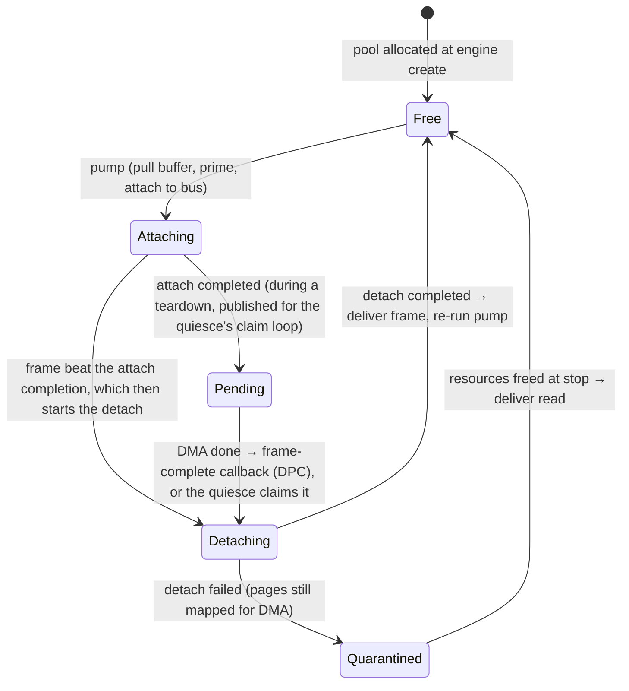
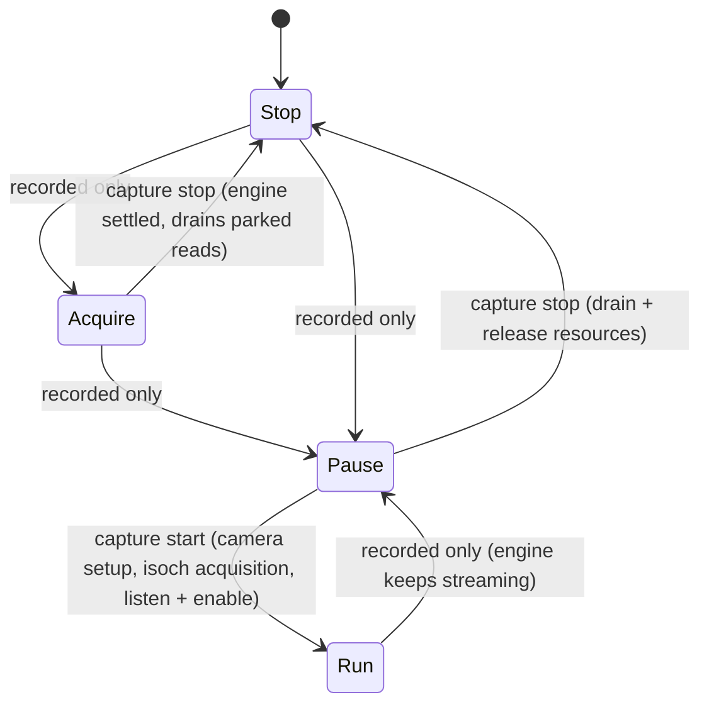
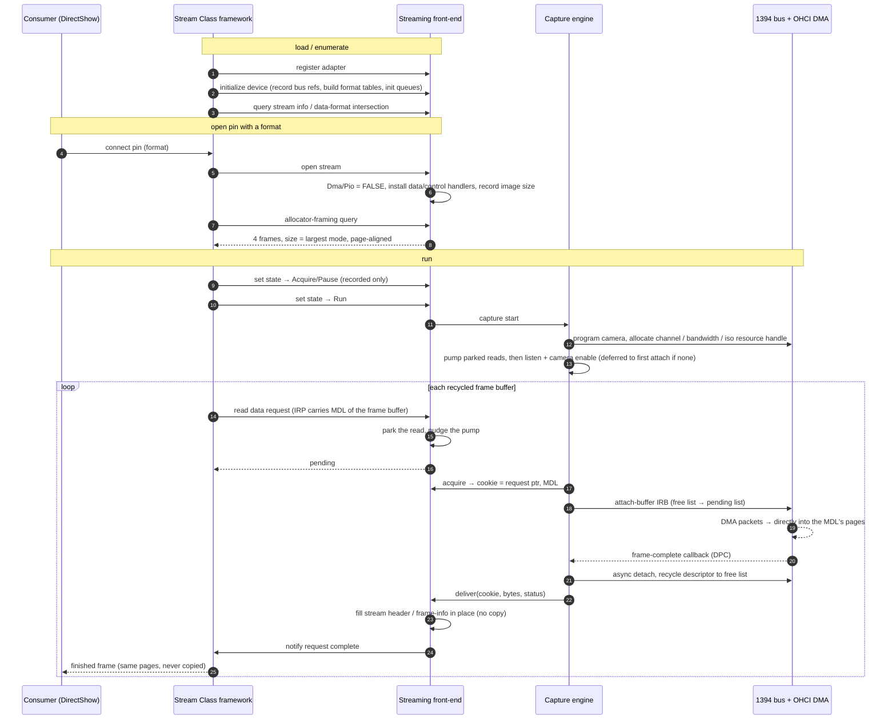

# Zero-copy frame capture — conceptual architecture

This document describes, at a conceptual level, how the driver captures
isochronous video frames from a 1394 (FireWire) DCAM camera without the CPU
ever copying pixel data (zero-copy).

Two client-facing interfaces sit on top of the same capture back-end:

- the **Streaming interface**, driven by the Windows **Stream Class** framework
  (`stream.sys`) and consumed by DirectShow — described conceptually here;
- the **Direct-buffer interface**, a `DeviceIoControl` protocol used by the
  vendor user-mode library — described in a separate concrete design document,
  [ioctl-interface-design.md](ioctl-interface-design.md), which keeps the
  real symbol names.

Both are zero-copy and both reuse the shared capture engine described in §3.

---

## 1. The zero-copy principle

A video frame arrives as a burst of isochronous packets that the 1394 host
controller (OHCI) writes into host RAM **by DMA**. Zero-copy follows from one
rule:

> The physical pages the **consumer** will read are the **same** physical pages
> the DMA engine writes into. The driver describes the consumer's frame buffer
> with a **memory descriptor list (MDL)** and hands that MDL to the 1394 bus
> driver as the DMA target. The minidriver's CPU never reads or writes a pixel.

Everything else is bookkeeping around that single handoff: obtain an MDL for a
buffer, pin its pages, submit it to the bus, learn when its DMA finished, hand
the filled buffer to the consumer, recycle the control block.

The only thing that differs between the two client interfaces is **who owns the
buffer** and therefore **where the MDL comes from** (§4).

---

## 2. Actors and layers

```
   consumer                    minidriver (this driver)                bus stack
 ┌───────────┐   frames   ┌──────────────────────────────┐   IRB   ┌────────────┐
 │ DirectShow│◀──────────▶│ Streaming front-end (KS)      │        │ 1394 bus   │
 │  or app   │            │ Direct-buffer front-end (IOCTL)│──────▶│  driver +  │──▶ OHCI DMA
 │           │            │  ── shared capture engine ──   │        │  controller│
 └───────────┘            └──────────────────────────────┘        └────────────┘
```

- **Consumer** — the entity that supplies (or is handed) frame buffers and reads
  finished frames.
- **Front-end** — adapts one client model to the engine. Two exist; they are
  mutually exclusive per open device.
- **Capture engine** — the shared, interface-agnostic core: owns descriptors,
  queues, and the conversation with the bus driver.
- **Bus stack** — the 1394 bus class driver, addressed with I/O request blocks
  (IRBs); it programs the OHCI controller, which performs the DMA.

---

## 3. The shared capture engine

### 3.1 Data structures you need

**Frame descriptor (per in-flight frame).**
A control block, one per frame that can be outstanding at once. It must contain,
as its *first* member, an array of the bus driver's isochronous-descriptor
structures (the bus writes results back into them, so they must sit at a stable,
non-paged address). Around that it carries:

| Field | Purpose |
|-------|---------|
| array of bus isochronous descriptors | first member; one entry per **chunk** of the frame (§3.4's buffer-size limit), each holding its chunk's **MDL**, DMA byte count and per-transfer flags. The first chunk synchronises on sy; only the last carries the completion callback + two context pointers |
| chunk MDLs | pre-allocated partial MDLs, rebuilt over the consumer's pages each cycle when the frame needs more than one chunk |
| back-pointer to the engine | so the DPC callbacks can reach shared state |
| **frame cookie** (`ULONG_PTR`) | opaque tag chosen by the front-end to recognise this frame on delivery |
| state | which lifecycle stage owns the descriptor (§3.3); transitioning it under the list spinlock is how racing completion paths claim it |
| completion status | decided when the descriptor is claimed for recycling, delivered to the front-end after the detach |
| pre-allocated IRP + embedded IRB | reusable request packet for attach/detach; allocating at DPC time is not allowed. The attach and the detach never overlap on one descriptor, so one IRP serves both |

Everything is drawn from **non-paged pool** and the IRP/IRB are **pre-allocated**
so the steady-state path performs no allocation.

**Two lists of descriptors.**
The engine keeps every descriptor on at most one of two intrusive
**doubly-linked lists**:

- **free list** — descriptors available to carry the next buffer;
- **pending list** — descriptors currently at the bus.

A descriptor is on neither list while its detach request is in flight (it
rejoins the free list from the detach completion) or while it sits in the
detach-failed quarantine (§3.2).

Implementation notes that matter for a reimplementation:
- The descriptors themselves live in a fixed pool embedded in the engine
  context; the lists only thread through them, so nothing is allocated per
  frame.
- Guard both lists and every descriptor's state field with a single
  **spinlock** — transitions happen at DISPATCH_LEVEL from the DPC path.
- The descriptor **state field is the single-completer handoff**: the
  frame-complete callback, the attach completion and the teardown all race to
  claim a descriptor, and whoever transitions the state under the lock owns
  it. Completions never search the lists — the bus driver hands the
  descriptor straight back through the callback context.

**Memory descriptor list (MDL).**
The zero-copy currency. Describes the physical pages of one frame buffer. The
front-end supplies it; the engine only stores it into the descriptor and forwards
it to the bus.

**Cookie-based correlation.**
The engine is oblivious to what a frame *means*. The front-end hands out a
`ULONG_PTR` cookie with every buffer the pump pulls (§3.2) and gets it back on
delivery. Choose it so it uniquely identifies the frame in the front-end's own
world (e.g. a request-block pointer, or a small frame index).

**Device / stream context.**
Per-device state: bus references, negotiated isochronous parameters (channel,
bandwidth handle, resource handle, bytes-per-packet, packets-per-frame), the two
lists + their spinlock, and a single pointer to the *active front-end's stream
context* — the DirectShow pin's, or the one embedded in the direct-buffer
capture slot. That pointer is published and cleared under the control mutex
together with each front-end's own owner pointer, so the two models cannot run
at once and the control work item can reach the engine without knowing which
front-end owns it.

### 3.2 Engine operations (abstract verbs)

**Acquire resources** — before any frame can flow:
1. program the camera's video mode and learn its packetisation
   (bytes-per-packet, packets-per-frame);
2. reserve an isochronous **channel** and **bandwidth** on the bus, and tell
   the camera which channel and speed to transmit on;
3. allocate an isochronous **resource handle** from the bus driver (this fixes
   buffer count, packet size, and the listen/strip flags, which depend on
   host-controller capabilities);
4. place all `N` pre-allocated frame descriptors on the **free list** and open
   the engine for pumping.

The concrete bus-driver requests behind these steps, and the host-capability
bits that shape the flags, are detailed in §3.4.

**Pump** — the zero-copy handoff. The engine *pulls* buffers rather than
having them pushed: at create time the front-end registers an **acquire
callback** (its buffer source) and a **deliver callback** (its per-frame
completion), then nudges the pump whenever a new buffer becomes ready. One
pump lap, repeated until either side runs dry:

1. claim a descriptor from the **free list** (stop when none —
   back-pressure);
2. pull the next ready buffer from the acquire callback, which returns a
   cookie and an MDL, or nothing (stop, put the descriptor back);
3. prime the descriptor's chunk entries over the buffer's pages, publish it on
   the **pending list** (state *attaching*), and send the attach request to
   the bus driver on the descriptor's reusable IRP. From here the controller
   DMAs one frame directly into the MDL's pages.

Pump runs are **elected**: a running flag plus a run-again flag let exactly
one caller lap the pool at a time while concurrent nudges fold into the
running lap, so buffers attach in exactly the order the front-end hands them
out. While the engine is idle or draining the pump attaches nothing, which is
what keeps front-end buffers parked until a start.

**Frame-complete callback (at DPC)** — the bus driver invokes the callback
stored in the frame's last chunk with `(engine, descriptor)` when the frame's
DMA finishes. The winner of the state race (§3.1) removes the descriptor from
the pending list, decides its completion status, and starts the recycle. A
frame that completes while its attach request is still in flight is only
marked; the attach completion starts the recycle instead, because the shared
IRP is still carrying the attach.

**Recycle** — an **asynchronous** *detach-buffer* request (DPC-safe, never
blocks) on the descriptor's reusable IRP. Its I/O-completion routine returns
the descriptor to the **free list**, hands the finished frame to the deliver
callback with the cookie, byte count and status (the pixels are already in the
consumer's pages), and re-runs the pump so the recycled descriptor can carry
the next buffer. A **failed** detach must not recycle: the buffer keeps a live
DMA mapping of the consumer's pages, so the descriptor is quarantined and its
read completes only once the isochronous resources are freed at stop.

**Start / stop** — toggle bus *listen* / *stop* and the camera's stream enable.
*Listen* has an ordering dependency on attached buffers — see §3.6. In
single-frame mode the continuous stream enable is never set; each acquisition
is armed individually through the camera's one-shot register instead (see the
IOCTL design doc).

### 3.3 Lifecycle of one descriptor



Note the steady state is a tight cycle — `pump → attach → DMA → complete →
detach → deliver → pump …` — that allocates nothing and runs entirely at
DISPATCH_LEVEL.

### 3.4 Bringing up the host controller and bus resources

All conversations with the 1394 (OHCI) host controller go through the **bus class
driver**: fill an I/O request block (IRB), set its `FunctionNumber` to a
`REQUEST_*` code, populate the matching union arm, and send it down synchronously
(build an IRP, `IoCallDriver`, wait on an event in the completion routine). There
are two phases: a **one-time device bring-up**, and a **per-session isochronous
acquisition** repeated whenever capture starts.

**One-time device bring-up** (when the device object is first initialized), in
order:

| Step | Bus request (`FunctionNumber`) | Why it matters |
|------|--------------------------------|----------------|
| Register bus-reset callback | `REQUEST_BUS_RESET_NOTIFICATION` (register) | install a routine the bus driver calls on **every** bus reset (§3.5) |
| Get generation count | `REQUEST_GET_GENERATION_COUNT` | the bus-topology generation number. **Stamp every asynchronous transaction with it** so a request issued against a stale topology is rejected instead of reaching the wrong node |
| Get local host capabilities | `REQUEST_GET_LOCAL_HOST_INFO`, level = host-capabilities (`GET_LOCAL_HOST_INFO2`) | the returned `HostCapabilities` bitmask drives the resource flags below — **keep it in the device context** |
| Get max speed to the camera | `REQUEST_GET_SPEED_BETWEEN_DEVICES`, flags = *use-local-node* | negotiated link speed: `1/2/4` ⇒ S100/S200/S400 (100/200/400 Mbps). Caps packet size and feeds bandwidth/channel/resource allocation |

(Locating the camera's control-register base and enumerating video formats are
DCAM/hardware concerns and are out of scope for this OS-facing document.)

**Per-session isochronous acquisition** (each time capture is armed), in order:

1. **Channel** — `REQUEST_ISOCH_ALLOCATE_CHANNEL` asking for *any channel*, so
   the bus driver picks a free one → the **channel number**. The camera is
   then told which channel and speed to transmit on via a control-register
   write, before it is ever enabled.
2. **Bandwidth** — `REQUEST_ISOCH_ALLOCATE_BANDWIDTH` with *(bytes-per-packet,
   speed)* → a **bandwidth handle**. Bytes-per-packet is bounded beforehand by
   the link speed: S100 ≤ 1024, S200 ≤ 2048, S400 ≤ 4096 bytes per isochronous
   packet.
3. **Resource handle** — `REQUEST_ISOCH_ALLOCATE_RESOURCES` with speed, channel,
   max-bytes-per-frame (= bytes-per-packet), max-buffer-size, and the buffer
   count → the **isochronous resource handle** used for every subsequent
   attach/detach/listen/stop.

   > **Buffer-size limit.** The inbox 1394 bus driver rejects this request with
   > an insufficient-resources error once max-buffer-size approaches 2 MB
   > (observed: 1,920,000-byte buffers are granted, 2,359,296-byte buffers are
   > refused). The queried `MaxDmaBufferSize` cannot be filled exactly either:
   > the bus driver validates max-buffer-size before any buffer exists, so it
   > assumes worst-case (mid-page) alignment, and a chunk that fills the reported
   > limit then spans one page too many (observed: a 2,095,880-byte chunk is
   > refused against a reported 2,097,152-byte limit). So max-buffer-size is one
   > **chunk**: the whole frame (packets-per-frame × bytes-per-packet) when it
   > fits a page under the limit, otherwise the largest whole-packet multiple
   > that does. A large frame is then
   > attached as one multi-descriptor request of chunk-sized **partial MDLs**
   > over the same consumer pages (still zero-copy): the first chunk synchronises
   > on sy, only the last carries the completion callback, and the buffer count
   > scales by chunks-per-frame.

   Its **flags** come from
   the host-capability bits captured at bring-up:

   | Condition | Flag effect |
   |-----------|-------------|
   | always | `RESOURCE_USED_IN_LISTENING` (this endpoint receives) |
   | host can strip or return the iso packet header | `RESOURCE_STRIP_ADDITIONAL_QUADLETS`, strip = 1 quadlet; otherwise strip = 0 |
   | host is **not** stream-based | `RESOURCE_USE_PACKET_BASED` |

   The resource is **non-circular**: buffers are attached lazily, one per
   pulled buffer, filled once and detached, so the buffer count is
   `(N + 1) × chunks-per-frame` (the extra frame slot is what a non-circular
   pool needs to keep one buffer attachable at all times).

4. Place the `N` frame descriptors onto the **free list** (§3.1).

The bandwidth handle, channel number, resource handle, and the packet geometry
are all **saved in the capture context** so a stop can release them, and a
release that failed during a stop is retried on the next start, before fresh
allocations would overwrite the recorded handles and strand the old resources.

### 3.5 Surviving bus resets

A bus reset (any hot-plug on the bus) bumps the bus **generation count**, and
the bus driver rejects any asynchronous transaction stamped with a stale
generation instead of letting it reach the wrong node. The registered reset
callback runs at DISPATCH_LEVEL, so it does the minimum: it flags the cached
generation count stale. The next asynchronous transaction, issued at
PASSIVE_LEVEL, sees the flag and re-reads the generation from the bus driver
before submitting. The bus driver delivers the notification only while the
camera is still present after the reset, so the callback needs no presence
check.

The driver does not try to carry an in-flight capture across a reset: it does
not re-allocate the channel, bandwidth or resource handle, and does not
re-attach pending buffers under a new handle. A capture session disturbed by a
reset is torn down and restarted by the client. The notification is registered
once at device bring-up and deregistered at device teardown.

### 3.6 Starting reception: attach before listen

Two ordering rules govern the transition from *resources acquired* to *frames
flowing*. Getting either wrong makes capture acquire all of its resources, report
a start failure, and then silently deliver **zero frames** — so they are worth
stating explicitly.

**Rule 1 — a buffer can only be attached once the resource handle exists.** The
attach request names the isochronous **resource handle** (§3.4) as its target;
issuing an attach before that handle has been allocated is rejected by the bus
driver with an **invalid-parameter** error. The pump must therefore attach
nothing until acquisition (channel → bandwidth → resource handle) has fully
completed. Concretely: the engine stays *draining* — the pump pulls no buffers
— until the resource handle is in hand, and the start opens it only then. This
matters because the front-end can race ahead: read requests may already be
parked, and the pump nudged, the instant the stream starts.

**Rule 2 — listening requires at least one attached buffer.** Asking the bus
driver to *listen* on a resource that has **no** buffer descriptors attached is
rejected with an **insufficient-resources** error. This is a normal, expected
condition, not a real failure — buffers are attached **lazily** (one per read
request, §5.5), and the stream can be told to run before any read has arrived.
The engine therefore never probes with a doomed listen; it issues the listen
only once an attach has completed:

1. at start, pump whatever buffers the front-end already holds, then wait
   briefly (a bounded wait of about a second) for the first attach completion
   and issue the listen synchronously;
2. when no attach completes in time, the start still succeeds — the listen is
   left to the **control work item**, which retries after each subsequent
   attach completion. Completion routines only record the fact and queue the
   work item; the listen itself is always issued at PASSIVE_LEVEL.

Treating the empty-at-run case as fatal is a common cause of the zero-frame
stall. The camera's own stream-enable has one ordering dependency of its own:
enable it only once the host is listening. A camera enabled before the listen
is active transmits its leading frames into the void — the receive context
synchronizes on a start-of-frame packet, so a missed first frame is skipped
entirely and delivery begins at frame 1. When the listen is still deferred at
run time, the camera enable is deferred with it (an *enable wanted* flag) and
performed by the control work item right after an attach completion confirms
the listen; waiting for a buffer at run time is unnecessary, since nothing can
be received before one is armed anyway.

**Resulting start order:** program the camera's mode and learn its
packetisation → allocate the channel → program the camera's channel and speed
→ allocate bandwidth → allocate the resource handle → *open the engine for
pumping* → pump any already-queued read buffers → listen → enable the camera,
with the last two deferred to the first attach completion when no buffer is
armed yet. From then on the steady-state loop (§3.3) keeps at least one
buffer attached at all times, so listening never lapses.

---

## 4. Two buffer-ownership models

The engine is identical either way; only the **origin of the MDL** and the
**completion action** differ.

| | **Framework-owned buffers** (Streaming / KS) | **Application-owned buffers** (Direct-buffer / IOCTL) |
|---|---|---|
| Who allocates the frame memory | the streaming framework's allocator | the user-mode application |
| How the MDL is obtained | delivered ready-made with each read request (the framework builds a locked MDL for every data buffer) | driver builds an MDL over the app's virtual range and **pins** it (`MmProbeAndLockPages`, write access, `__try/__except`) |
| Frame cookie | the read request-block pointer | the frame index |
| Buffer source (the pump's acquire callback, §3.2) | the head of the stream's parked reads, one per recycled read request | the next queued ring slot, in index order |
| Completion action | fill the frame-header metadata *in place*, notify the framework | bump counters, signal a registered event; app reads its own memory |
| Teardown of pages | framework owns them | driver **unpins** (`MmUnlockPages` + free MDL) on release |

The rest of this document covers the **framework-owned / Streaming** model. The
**application-owned / Direct-buffer** model is documented concretely in
[ioctl-interface-design.md](ioctl-interface-design.md).

---

## 5. The Streaming interface (conceptual)

### 5.1 Registration and bring-up

The minidriver registers with the Stream Class framework
(`StreamClassRegisterAdapter`) supplying an initialization block that declares:

- a **device-level request handler**, a **cancel handler**, and a
  **timeout handler**;
- the sizes of the framework-allocated **per-device** and **per-stream** context
  blocks;
- a buffer alignment;
- that the minidriver **serialises itself** (synchronization turned off).

At device init the framework hands over references to the underlying device
objects (via the port-configuration block); the minidriver records them, builds
its **stream/format descriptor tables**, and initialises the device context.
The capture engine itself — descriptor pool, lists, reusable IRPs — is created
when a stream opens. Standard framework request exchanges then let the graph
enumerate streams and negotiate a format.

### 5.2 Opening a stream

When a pin is connected with a chosen format, the front-end validates it
against the format table and records the negotiated geometry and image byte
size in the per-stream context (no frame memory is allocated; the camera
itself is programmed later, on the transition to Run — §5.4). A format that
matches no enumerated mode still opens the pin, with the data path left idle.
The open also configures the **per-stream data path**:

- declare that the minidriver accesses the frame buffers **neither by DMA nor by
  PIO** (`Dma = FALSE`, `Pio = FALSE`); each read request carries its frame
  buffer as an **MDL** in the request's IRP either way (§5.5);
- install the per-stream **data-request** and **control-request** handlers;
- declare the size of the per-frame **frame-info** metadata appended to each
  stream header.

> **Dma/Pio flags.** These declare how the *minidriver itself* will access each
> data buffer: `Dma` requests physical-address/scatter-gather preparation for
> the minidriver's own busmaster hardware, `Pio` requests a CPU-accessible
> mapping. The Stream Class framework populates `Srb->Irp->MdlAddress` for
> every data buffer **regardless of either flag**. This driver is a pure
> pass-through that hands that MDL to the 1394 bus driver and never maps the
> pixels, so both flags are `FALSE`.

### 5.3 Buffer supply — allocator framing

The framework asks the minidriver how to allocate frames (an *allocator-framing*
property query). The minidriver answers with:

- **frame count** = a small ring (4), matching the engine's descriptor pool so
  every buffer can be attached at once;
- **frame size** = the byte size of the **largest advertised mode**, so a
  single allocator can back any format the pin may be connected with;
- **alignment** = page-aligned;
- system memory from **paged pool**, declared as preferences rather than hard
  requirements.

So the framework allocates a handful of **page-aligned** frame buffers and
recycles them through the pin. Page alignment keeps the DMA mapping simple.

### 5.4 Streaming state machine

Pin state changes map onto engine resource lifetime:



Only two transitions act on the engine. Entering **Run** performs the whole
capture start of §3.6 — programming the camera, acquiring the isochronous
resources, pumping parked reads, listening and enabling — and returns success
immediately when already streaming. Entering **Stop** publishes the stopped
state first (so a racing read either parks in time to be drained or is
rejected), then drains and releases everything. Every other transition merely
records the new state; in particular Run → Pause leaves the engine streaming
until Stop arrives. Each state change runs under the device's control mutex,
serializing it against the IOCTL handlers, cleanup and the control work item.

Crucially, buffers are **not** attached on the state transition — they attach
**lazily, one per data request** (§5.5). Because of this, the *run* transition
can be reached before any buffer is attached, so the bus *listen* and the
camera enable tolerate the empty case and defer — see §3.6. Master-clock
control requests are acknowledged but not consumed: the driver stamps no
clock-based presentation times (§5.5).

### 5.5 Per-frame data path (the hot loop)

**Where the frame buffer and its MDL come from.** The frame *buffers* are
allocated by the Stream Class framework's proxy allocator, sized and aligned
exactly as the minidriver requested in the allocator-framing reply (§5.3): four
page-aligned buffers, each large enough for the largest advertised mode, in
system memory. The minidriver never
allocates them, never maps them, and never sees their virtual addresses. When a
buffer is due to be filled, the framework issues a **read data request** to the
per-stream data handler — a request block whose command is `SRB_READ_DATA`. The
framework has already **built a locked MDL over that frame buffer and hung it off
the request's IRP** (this happens for every data buffer, independent of the
Dma/Pio flags — see the note in §5.2). The minidriver therefore reads the MDL straight out
of the request as `Srb->Irp->MdlAddress` — that pointer *is* the zero-copy DMA
target. It is handed one for free, in contrast to the application-owned model
where the driver builds and pins the MDL itself.

The steady loop:

1. A read request arrives at the data handler carrying that ready-made MDL;
   the companion stream header to fill in later is at the request's
   data-buffer pointer. The handler marks the request *pending*, **parks** it
   on the stream's read queue, and nudges the engine's pump.
2. The pump pulls the parked read through the acquire callback — cookie = the
   **request-block pointer**, buffer = that MDL — and attaches it to the bus
   (§3.2).
3. The controller DMAs the frame into those pages.
4. On delivery (DPC, after the engine has detached and recycled the
   descriptor), the front-end callback recovers the request from the cookie.
5. The front-end fills the stream header and frame-info metadata **in place**
   (bytes-used = the captured frame size, bytes-per-packet ×
   packets-per-frame capped to the buffer, a 1-based picture number claimed
   with an interlocked increment, duration = the negotiated frame interval;
   no clock-based presentation time) — no pixel copy, the pixels are already
   there — and notifies the framework that the request is complete.
6. The framework hands the finished buffer to the consumer and later recycles
   it back as another read request.

A cancelled read still parked on the read queue completes cancelled inline in
the cancel handler; one the engine holds is resolved by the control work item,
which quiesces the engine so the read comes back through the same delivery
path — cancelled with zero bytes used, or delivered normally when its frame
had already completed by the time the quiesce claimed it. Read timeouts are
disabled while a read is parked or attached (the timeout handler only logs):
a buffer legitimately waits as long as the producer takes.

### 5.6 Streaming sequence



---

## 6. Operating-system mechanisms

**Stream Class framework**
- register the adapter and its request/cancel/timeout handlers;
- complete device- and stream-level requests via the framework's notification
  calls;
- acknowledge master-clock requests without consuming them (no clock-based
  presentation times, §5.5);
- per-stream: declare the buffer-access mode (neither DMA nor PIO), install the
  data/control request handlers, and declare the per-frame metadata size.

**I/O manager**
- one **reusable IRP per descriptor** (allocate once, resubmit forever);
- I/O-completion routines that return *more-processing-required* so the
  reusable IRP survives for the next attach/detach cycle;
- retrieve the current stack location; complete requests; check the caller's
  bitness when a private ABI is involved.

**Memory manager — the zero-copy primitives**
- build an **MDL** over a buffer;
- **pin** user pages for DMA (`MmProbeAndLockPages`, write access) inside a
  structured-exception guard — only for the application-owned model; the
  framework-owned model receives its MDL ready-made;
- **unpin** + free the MDL on teardown;
- build **partial MDLs** over sub-ranges of the consumer's pages when a frame
  needs more than one chunk (§3.4), preparing each for reuse before rebuilding
  it on the next cycle.

**Kernel objects and synchronization**
- a **spinlock** guarding the two descriptor lists and the descriptor states
  (operations occur at DISPATCH_LEVEL);
- a **kernel mutex** serializing the whole control plane at PASSIVE_LEVEL:
  start, stop, listen, cancel resolution, and the publication of the active
  front-end context all run under it, so exactly one context at a time
  performs a control transition while the per-frame data path stays
  lock-free of it;
- a **work item** as the control plane's PASSIVE_LEVEL executor for
  transitions requested from DISPATCH_LEVEL (a request cancel, a listen that
  became possible after the first attached buffer) — completion routines
  record one fact and queue it, and never issue listen or stop requests
  themselves. An interlocked coalescing flag collapses a burst of triggers
  into one queued run;
- a *removed* flag, stored under the control mutex at surprise removal and
  observed under the read queue's spinlock, checked before hardware access
  (the lock pairing, not an interlocked operation, is what synchronizes it);
- reference a user event object by handle, signal it, and dereference it — for
  the notification model of the application-owned interface;
- events + waits for the first-attach handoff (§3.6) and the teardown drain;
- interlocked counters for in-flight request accounting;
- non-paged pool allocations with a private tag.

**Data-structure toolkit**
- two intrusive **doubly-linked lists** (free and pending) threading a fixed
  descriptor pool, guarded by one spinlock together with the descriptor
  states (§3.1);
- a **doubly-linked list** for the notification registrations of the
  application-owned interface (see the IOCTL design doc);
- standard intrusive-list helpers (`CONTAINING_RECORD`, list insert/remove).

**Bus stack** — address the 1394 bus driver with I/O request blocks (IRBs):
- *bring-up:* register/deregister a bus-reset notification, get the generation
  count, get local host capabilities, get the max speed to the device (§3.4);
- *acquisition:* reserve/free bandwidth, allocate/free a channel, allocate/free
  an isochronous resource handle;
- *streaming:* attach/detach buffers (synchronous and DPC-async variants), listen,
  and stop;
- stamp every asynchronous transaction with the current generation count.
